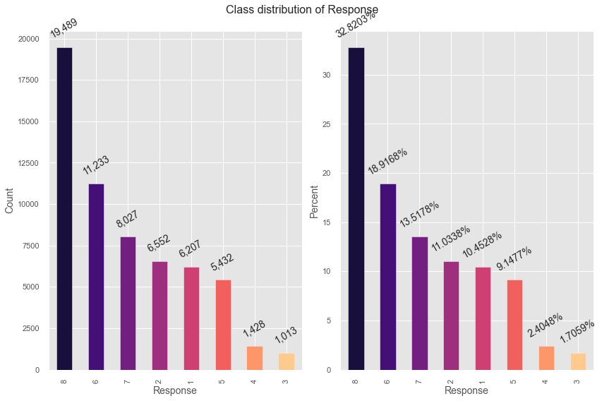
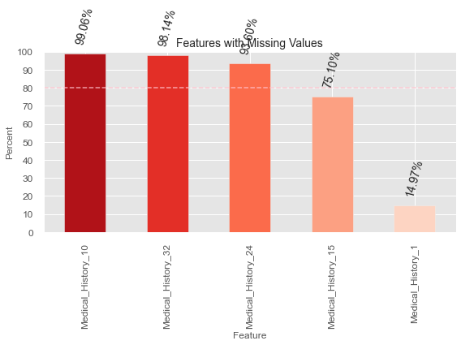
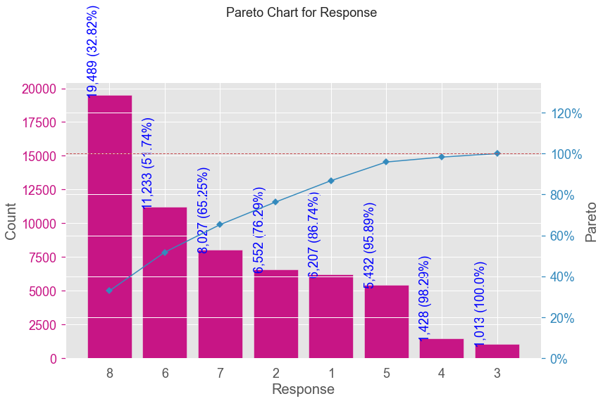
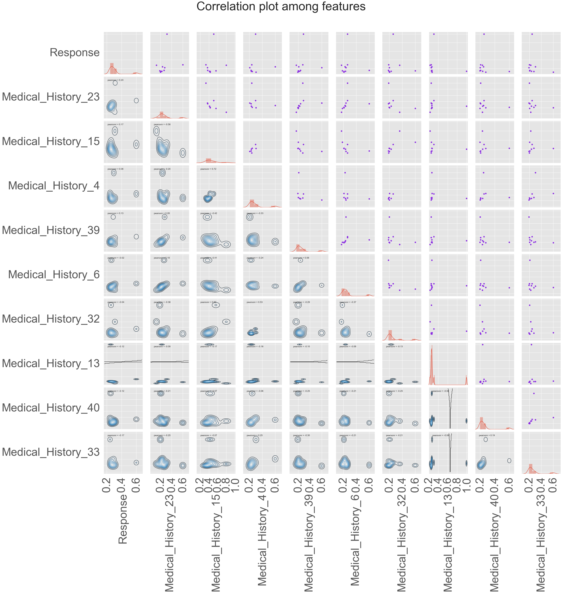
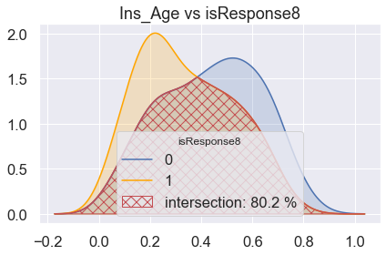
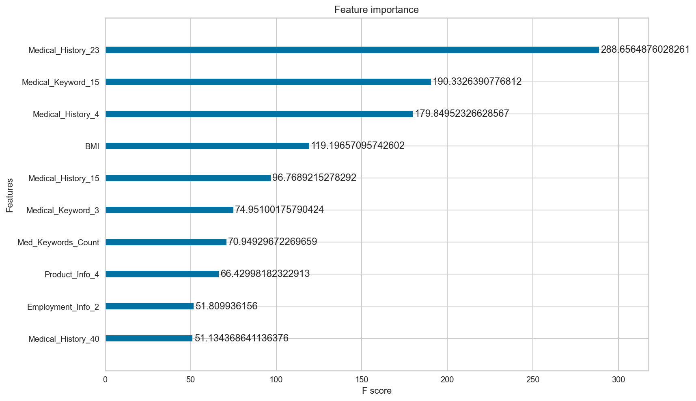
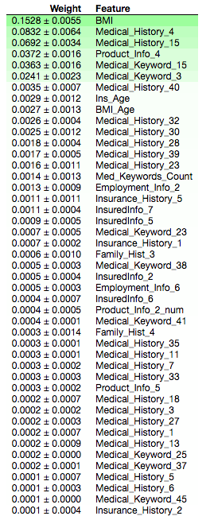
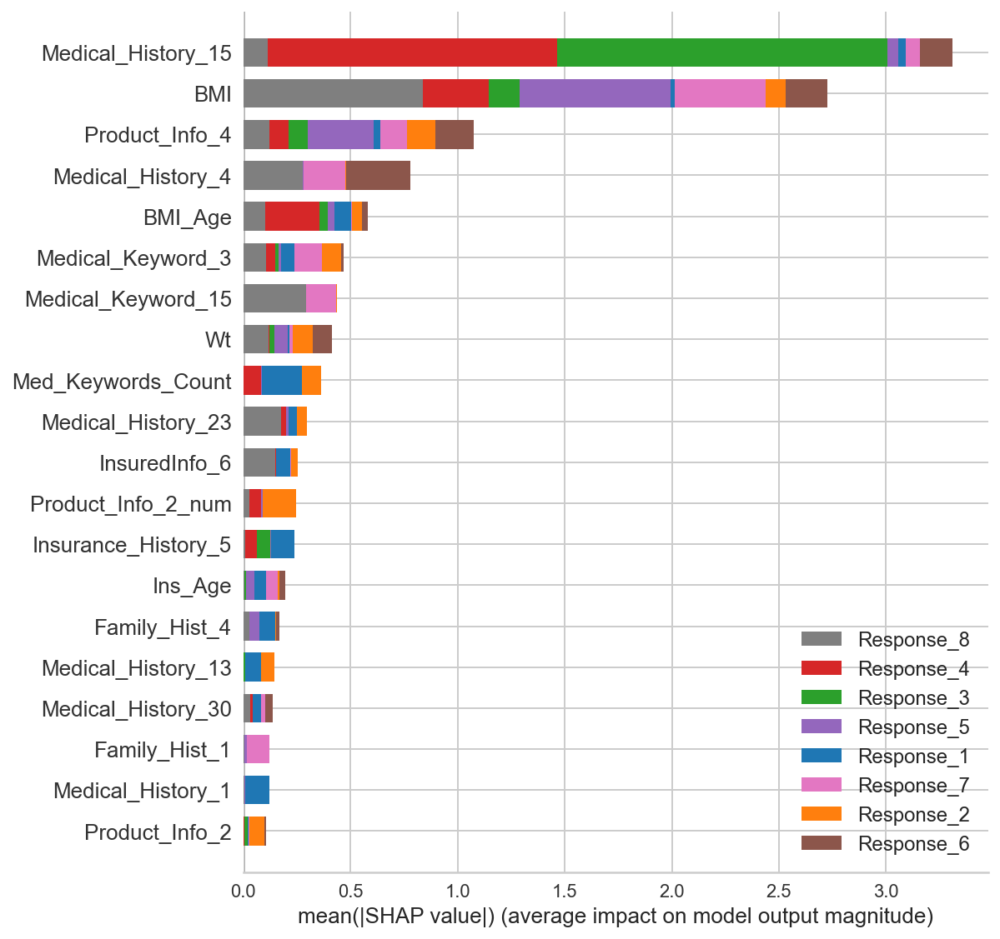
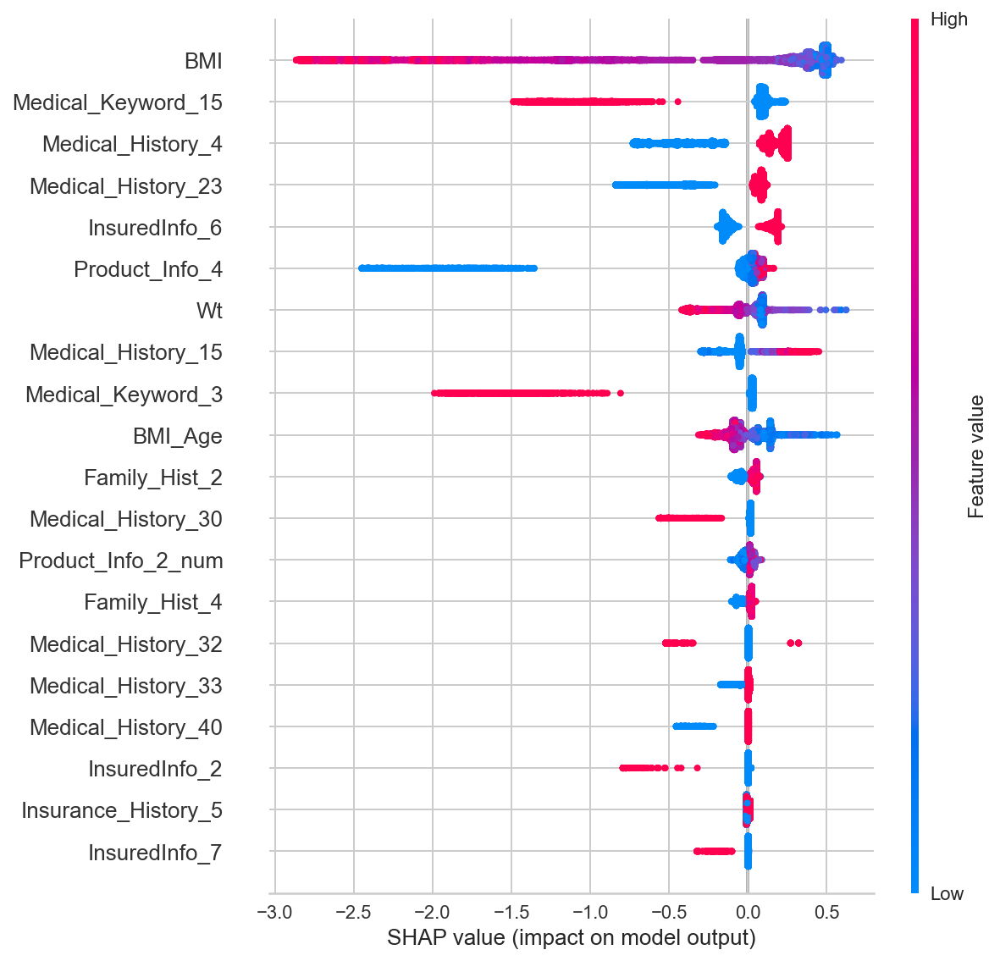

# Description
Author: [Bhishan Poudel](https://bhishanpdl.github.io/index.html)  
Project: Prudential Life Insurance policy prediction ([Company](https://www.prudential.com/))  
Kaggle project page: [Prudential Life Insurance Assessment](https://www.kaggle.com/c/prudential-life-insurance-assessment)  
Task: Multiclass classification (Response 1 to 8)  
Metric of evaluation: Quadratic Weighted Kappa 

Data  
```
Here Response 8 has the highest counts, I assume it the quote that is granted.

Records: 60k
Features: 127
Target: Response (has 8 categories, 1-8)

Features:

1 Misc             : Age ht wt bmi              4
2 Product Info     : Product_Info_1 to 7        7
3 Employment Info  : Employment_Info_1 to 6     6
4 Insured Info     : InsuredInfo_1 to 7         7
5 Insurance History: Insurance_History_1 to 9   9
6 Family History   : Family_Hist_1 to 5         5
7 Medical History  : Medical_History_1 to 41    41
8 Medical Keywords : Medical_Keyword_1 to 48    48
Target: Response                                1
ID    : ID                                      1
---------------------------------------------------
Total Features: 127
Dependent Variable: 1 (Response)
```

# Metric of Evaluation
Quadratic weighted kappa is rank based metric used for multiclass classification.
It has the minimum value 0 (random guess) and maximum value 1 (total agreement).

```python
from sklearn import metrics
score = metrics.cohen_kappa_score(ytest,ypreds,weights='quadratic')
```
# Exploratory Data Analysis







# Modelling
I have tried various machine learning models for this project.
The results are presented below.

**Linear Regression**  
```
Weighted quadratic kappa = 0.569630318923444
```

**Xgboost Classifier softprob** 
```
objective = "multi:softprob"


Cleaning   eval_metric   kappa
simple     default       0.5377897181694622
detailed   default       0.5438646999324421
simple     custom        0.5530053047703208
detailed   custom        0.5407784634778012

```

**Xgboost  poission regressor**  
```
objective = "count:poisson"

   Model	              TrainKappa	TestKappa
0	xgb reg	              0.669651	  0.603765
1	xgb reg + offset	    0.720368	  0.649496
2	xgb poisson          	0.682188	  0.609387
3	xgb poisson + offset	0.735050	  0.655627

```

**Xgboost poisson regressor ensemble voting**  
```
	Model	                TrainKappa	   TestKappa
0	xgb reg              	0.669651	     0.603765
1	xgb reg + offset	    0.720368	     0.649496
2	xgb poisson	          0.682188	     0.609387
3	xgb poisson + offset	0.735050	     0.655627
4	ensemble            	0.623919	     0.593312
5	ensemble + offset	    0.683268	     0.644076
```

# Xgboost Model Explanation






